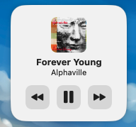
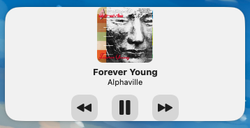
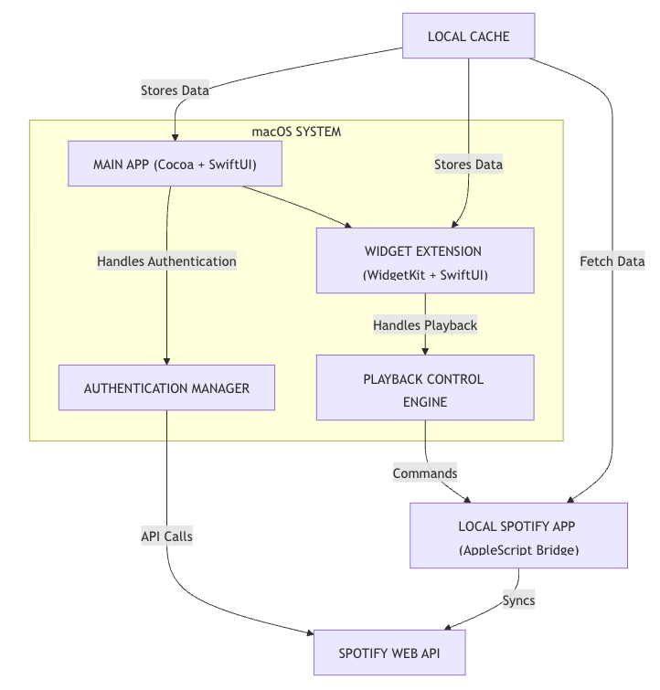
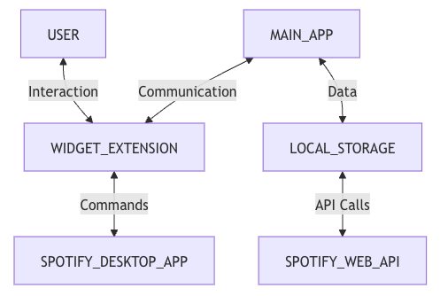

# Spotify Widget for macOS

A sleek, elegant macOS widget that displays your currently playing Spotify track and provides playback controls right from your desktop.





## Features

- 🎵 Display currently playing track information (title, artist, album art)
- ⏯️ Playback controls (play/pause, next track, previous track)
- 🔄 Auto-refreshing widget that updates when tracks change
- 🔌 Hybrid control system using both Spotify Web API and AppleScript
- 🔐 Secure authentication with Spotify
- 💾 Local caching of album artwork for faster loading and offline viewing

## Prerequisites

- macOS 11 Big Sur or later
- [Spotify](https://www.spotify.com/download/) desktop app installed
- A Spotify account (free or premium)
- Xcode 13+ for building the project

## Installation

### From Source

1. Clone this repository:
   ```bash
   git clone https://github.com/yourusername/MusicWidgetApp.git
   ```

2. Open the project in Xcode:
   ```bash
   cd MusicWidgetApp
   open MusicWidgetApp.xcodeproj
   ```

3. Update the Bundle Identifier and Team in the project settings to match your Apple Developer account

4. Build and run the application (⌘+R)

## Usage

1. **First Launch**: When you first launch the app, click "Login with Spotify" to authenticate
   
2. **Add Widget**: 
   - Open the Notification Center by clicking on the time in the menu bar
   - Click "Edit Widgets" at the bottom
   - Find the "Spotify Widget" in the widget gallery
   - Choose either small or medium size and add it to your desktop

3. **Control Music**:
   - Play/Pause: Click the play/pause button
   - Next Track: Click the forward button
   - Previous Track: Click the backward button

4. **Widget Updates**: The widget automatically refreshes every 5 seconds to show your current track

## Configuration

### Spotify API

The app uses the following Spotify API permissions:
- `user-read-playback-state` - To read your current playback state
- `user-read-currently-playing` - To see what's currently playing
- `user-modify-playback-state` - To control playback (play, pause, next, previous)

### App Settings

- The app runs as a menu bar application for convenience
- Song data is cached locally in your user Documents folder
- Album artwork is cached for offline viewing

## Troubleshooting

### Playback Control Issues

If you experience issues with playback controls:

1. **Check Spotify Connection**: Ensure Spotify is running on your computer
2. **Refresh Authentication**: Try logging out and back in if the authentication expires
3. **Use Desktop App**: This widget works best when controlling the local Spotify desktop app

### Widget Not Updating

If the widget doesn't update with the current track:

1. **Force Refresh**: Open the main app and click "Force Refresh Widget"
2. **Check Spotify Status**: Ensure Spotify is playing music
3. **Restart Widget**: Remove and re-add the widget to the Notification Center

## Technical Details

### Architecture

The app consists of two main components:
- **Main App**: Handles authentication and serves as a configuration panel
- **Widget Extension**: Displays track information and handles playback controls

### Architecture Diagram



### Architecture Key Components

1. **Main App**: Handles authentication, serves as a configuration panel and provides initial background refresh
2. **Widget Extension**: Displays track information and handles playback controls
3. **Authentication Manager**: Manages OAuth tokens, handles token refresh and stores credentials securely
4. **Playback Control Engine**: Implements dual-control strategy (API + AppleScript), handles state synchronization and fallback logic
5. **Local Cache**: Stores album artwork, caches playback state and shares data between app and widget
6. **Spotify Web API**: Provides cloud-based playback control
7. **Local Spotify App**: Provides local playback control

### Data Flow Diagram


### Data Flow Key Components

1. User -> Widget Extension:
   - User clicks play/pause, next track, previous track
   - Widget Extension updates playback state via API or AppleScript
   - Widget Extension requests current track info from API
   - Widget Extension displays track info and artwork

2. Widget Extension -> Main App:
   - Widget Extension requests current track info from API
   - Main App updates local cache
   - Main App refreshes widget

3. Main App -> Local Storage:
   - Main App writes authentication tokens and playback state to local storage
   - Main App initiates background refresh

4. Local Storage -> Spotify Web API:
   - Local storage requests current track info from API
   - Spotify Web API returns track info

5. Spotify Web API -> Widget Extension:
   - Spotify Web API returns track info

6. Spotify Web API -> Local Spotify App:
   - Spotify Web API sends playback commands to local app

7. Local Spotify App -> Widget Extension:
   - Local app sends current track info to widget


### Control Methods

The app uses a hybrid approach for reliability:
1. **Primary Method**: Spotify Web API for rich data and remote control
2. **Fallback Method**: Local AppleScript commands when API calls fail

## Privacy

This app:
- Does not collect any user data
- Stores authentication tokens locally in a secure container
- Caches song data and artwork locally for performance

## License

This project is licensed under the MIT License - see the [LICENSE](LICENSE) file for details.

## Acknowledgments

- [Spotify Developer Platform](https://developer.spotify.com/) for their API
- [Apple WidgetKit](https://developer.apple.com/documentation/widgetkit) for the widget framework

## Contributing

Contributions are welcome! Please feel free to submit a Pull Request.

1. Fork the project
2. Create your feature branch (`git checkout -b feature/amazing-feature`)
3. Commit your changes (`git commit -m 'Add some amazing feature'`)
4. Push to the branch (`git push origin feature/amazing-feature`)
5. Open a Pull Request

---

*Note: This is not an official Spotify product. This app is developed independently and is not affiliated with Spotify AB.* 